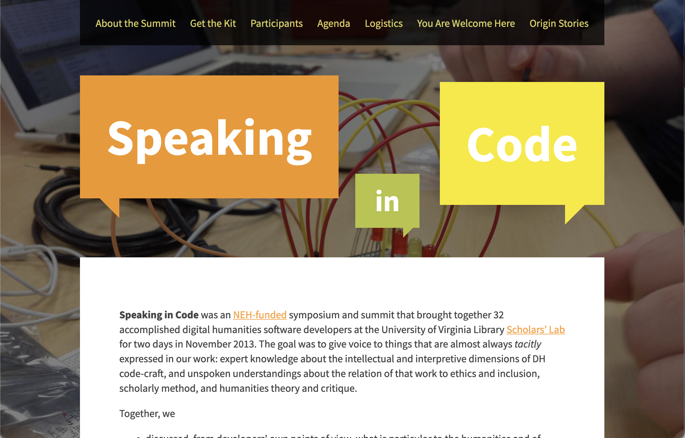

Hello! I'm Jeremy. I'm the Head of Research and Development for the [Scholars' Lab](https://scholarslab.lib.virginia.edu), at the University of Virginia Library. My research interests include digital humanities, feminist interface design, and expressions of history/culture/identity in table-top role-playing games, particularly Dungeons & Dragons.

## Practicum

**Speaking in Code**

[Speaking in Code](https://codespeak.scholarslab.org) was a two-day unconference that brought developers and designers in DH together, to disucss the ways their tacit knowledge impacted DH scholarship and pedagogy.

## Coursework

## Related Writing
